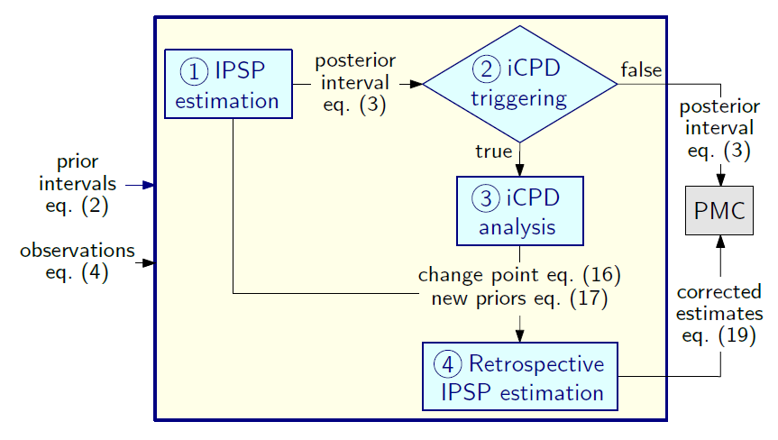
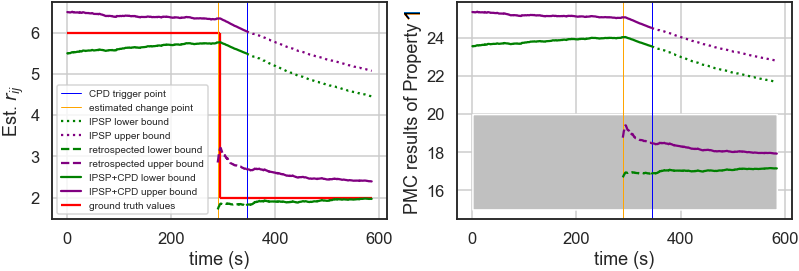

# iCPD
[Interval Change Point Detection for Runtime Probabilistic Model Checking](https://x-y-zhao.github.io/files/ASE2020.pdf), (to appear in ASE2020)

## Overview of iCPD
We introduce iCPD as an online change-point detection (CPD) technique that tailored for runtime probabilistic model checking (PMC) applications using interval Markov models. It is essentially composed of two parts -- a robust Bayesian estimator on Markov model parameters and a Bayesian CPD procedure. The two Bayesian components are assembled in a loop with automatic trigger rules to invoke each other:

  
   
  An overview of iCPD that supports runtime PMC (cf. the original paper for equations and detailed descriptions)
   

## Typical results of iCPD
We conducted extensive experimental evaluation to assess the accuracy, configurability and efficiency of iCPD, and also did a case study
reusing a popular open-source [robotics exemplar](http://eprints.whiterose.ac.uk/113455/1/SEAMS_2017_UNDERSEA.pdf) to show how iCPD supports the runtime PMC of system-level properties.

A typical example of applying iCPD shows:

  
   
  A change of $r_{ij}$ (an unknown transition rate of continuous-time Markov chains) being detected by iCPD (left), and how it affects the PMC results of a system-level property (right).
   

## Repository Structure
Each folder maps to some experiments in the paper, in which you may find both the code (in Python and Java), the Markov models (for the case study) and the original data generated (stored as HTML and .csv files). To be exact:
* **Step_change** associates the scenarios #A (big step), #B (medium step) and #C (small step) in RQ1;
* **Square_change** associates the scenarios #D (normal recovery) and #E (quick recovery) in RQ1;
* **Ramp_change** associates the scenarios #F (steep ramp) and #G (gradual ramp) in RQ1;
* **Earlier_change** associates the scenario #H (earlier big step) in RQ1;
* **No_change** associates the scenario #I (fixed) in RQ1;
* **Configurability** associates the 3 studies for RQ2 on configuring iCPD for the sensitivity to changes;
* **Overheads_analysis** associates the study for RQ3 on the efficiency of iCPD;
* **For_CTMCs** associates some repeated numerical examples for DTMCs in the paper.
* **UNDERSEA_case_study** contains the case study results.
* **images** contains some figures used in the paper and in this readme file.

